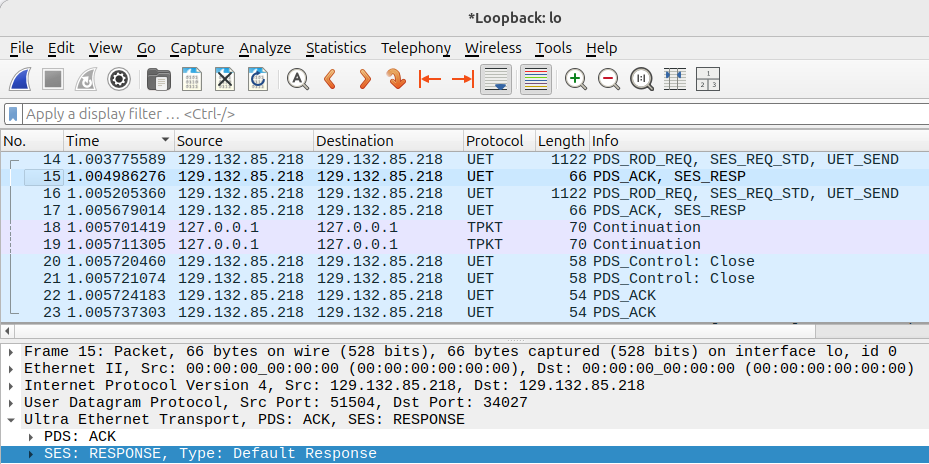

# SUET: Software Ultra Ethernet Transport provider

SUET is a libfabric provider that implements wire-compatible UET PDS (Packet Delivery Sublayer) and SES (Semantic Sublayer) protocols in software. SUET can run on top of any datagram transport available in upstream libfabric, such as Verbs and UDP. 

SUET is developed at the Scalable Parallel Computing Lab (SPCL) at ETH Zurich for Ultra Ethernet and general AI and HPC networking protocol research.

### 1024 byte message ping pong traced with Wireshark UET dissector


## Quick Start

```bash
./build.sh
./build.sh --test
```

See `INSTALL.md` for more details.

To build and test SUET over the htsim network model:

```bash
./build.sh --htsim
./build.sh --test-htsim
```

The provider, runner, tests and build integration are in [htsim/](htsim/README.md).
The simulator dependency is fetched at a pinned revision, or supplied through
`HTSIM_SOURCE_DIR`. Use `--htsim-only` to reuse an existing SUET/libfabric install.

## Provider architecture

### Portable design
The SUET provider is a major rework of the RxD libfabric provider. Similarly to RxD, SUET enables connectionless reliable messaging endpoint semantics over connectionless unreliable endpoints (`FI_EP_RDM` over `FI_EP_DGRAM`), while also adding zero-copy send path and batched CQ polling optimizations. A core `FI_EP_DGRAM` provider serves as a portable abstraction layer for the wire protocol that encapsulates PDS/SES traffic. Thanks to that, SUET runs on Linux (UDP and Verbs) and macOS (UDP).

### SES/PDS boundary

The SES/PDS and PDS/datagram API headers define direct calls between layers.
There is no operations table or new function-pointer dispatch.

- SES owns operation buffers, message segmentation, endpoint matching, RMA
  validation, atomic execution, unexpected messages, and application completions.
- PDS owns PDCs, PSNs, transport queues, wire ACK/NACK handling, and
  response retention. Reliability manages windows and retry decisions through
  `suet_rel.h`. PDS private types live in `suet_pds.h`; SES-only types live in
  `suet_ses.h`. Helper implementations stay in the corresponding `.c` files.
  The SES/PDS contract lives in `suet_ses_pds_api.h`.
  `suet.h` includes the three layer headers and embeds their resource structures
  directly in the domain; no separate SES/PDS resource allocation is needed.
- Datagram owns provider setup, packet pools and registration, send/receive
  posting, CQ polling, and provider prefixes in `suet_dgram.c`. Its resources
  and lifecycle are declared in `suet_dgram.h`; the packet/event contract with
  PDS lives in `suet_pds_dgram_api.h`. Provider contexts stay private to datagram.
  PDS sees wire lengths excluding provider prefixes. Local send
  completion releases provider access; PDS independently tracks acknowledgment
  and retry retention. Each packet still occupies one pool allocation, with
  separate aligned datagram, PDS, and SES records. Datagram keeps provider-busy
  state and its posted-receive node private; PDS owns PDC identity, packet
  retirement state, and its queue node; SES owns its unexpected-message packet node.
  The shared packet view carries storage/I/O information and opaque layer
  contexts, without shared flags or list membership.
- Each transmission has a separate PDS record with an opaque SES context. PDS
  supplies a semantic-header region and asks SES for header bytes plus payload
  IOVs and registration descriptors. PDS assembles the wire packet and reports
  terminal completion through direct calls. Header preparation writes directly
  into the existing packet allocation; it adds no header or payload copy.
  SES uses the semantic-byte budget exposed by PDS to derive payload limits,
  including space for atomic extensions. SES never calculates PDS header sizes,
  traverses PDC queues, or assigns packet sequence numbers.
- Ordered receive state lives in an opaque SES context associated with the
  transport stream. PDS strips its framing; SES validates and separates its
  header/extensions from the payload. Ordered dispatch receives that view and
  an opaque release handle. Retained packets keep a copy of the view in their
  existing SES record, including for peek/claim/discard. PDS persists any
  required response before committing the SES receive completion.
- Unexpected messages hold opaque response reservations. Completing or
  cancelling a reservation goes through PDS; SES does not mutate retained
  response lists. Closing a PDC invalidates the route while outstanding SES
  reservations remain safe to release.

The boundary shares semantic views, opaque lifetime handles, and response metadata. The existing
wire headers, Go-Back-N algorithm, per-domain locking, and datagram/zero-copy
buffer lifetime rules are unchanged. Calls require the domain FEP lock or
exclusive initialization/close. Domain close drains PDS, stops the datagram
endpoint, then releases layer state and packet storage. No new dispatch table,
reliability algorithm, or progress thread is introduced.

### Reliability boundary

`suet_rel.h` defines a direct-call contract; `suet_rel.c` implements Go-Back-N.
The implementation takes PSNs, decoded feedback and monotonic millisecond
timestamps, with no PDC types, wire headers, packet pointers or SES dependency.
PDC assigns PSNs and owns the packet-pointer arrays; reliability owns circular
bitmap windows and retry state. Bitmap slots and pointer slots share the same
index through `suet_rel_slot()`. ACK processing returns the retired slot range;
PDS detaches those pointers before progressing new transmissions. Packets still
borrowed by datagram remain on PDS's lifetime list until local completion.

ROD delivery ordering stays in PDS. Its receive pointer array can retain packets
admitted ahead of the delivery position by another reliability implementation.
The GBN implementation currently discards future PSNs, independently of the
PDC delivery type. This separation does not add RUD wire or SES support.
Replacing the reliability implementation does not require a function-pointer
table or per-packet allocation. Existing PSN-range message completion, semantic
response replay and connection lifecycle remain in PDS.

The default window remains 128 packets. GBN retains cumulative ACKs, the
existing ACK cadence, timeout-driven recovery (received NACKs do not trigger
immediate retransmission), per-packet attempt timestamps and a per-connection
retry-round budget. Backoff starts at 1 ms and saturates safely at 4 seconds.
Local send failures remain tracked for recovery and retry attempts retain the
existing timing/accounting. Wire structures are unchanged. `max_unacked` is
clamped to 1..65535 to match PDS's packet counter; negative retry limits become
zero. An ACK covering an untracked PSN is rejected without retiring packets.

### Simulation clock

`suet/src/suet_ext.h` exposes an optional per-domain clock through
`fi_set_val(&domain->fid, FI_SUET_CLOCK, &clock)`. Install it before creating
endpoints. The callback returns monotonic elapsed milliseconds; its context
must remain valid until the domain closes. The record is copied by SUET.
A null callback restores the normal clock. Retry intervals and wire formats
are unchanged.

A discrete-event driver can also set `FI_SUET_CLOCK_ASYNC_CLOSE`. In this mode,
`fi_close(domain)` returns `-FI_EAGAIN` while PDS teardown needs further
progress. The driver must keep advancing its network and retry closing all
participating domains. Without this flag, the existing blocking close behavior
is preserved. This supports the [htsim_suet runner](htsim/README.md) without simulator
dependencies in the SUET provider.

### Key provider features

- Basic UET SES request/response flow
- Guaranteed delivery UET SES requests
- UET Reliable Ordered Delivery (ROD) PDC
- Zero-RTT PDC establishment
- Zero-copy send path, per-packet memcpy at the receiver
- Unexpected message buffering
- Go-Back-N reliability (always enabled; `FI_SUET_RETRY` is no longer supported)

Many of the UET specification features are not yet supported, including but not limited to:
- RUD PDC, SR-based reliability and endpoint congestion control
- JobID and PIDonFEP validation
- TSS layer

### Test coverage:
- SUET tested with libfabric fabtests, OpenMPI and MPICH
- Basic header formats tested against Wireshark UET dissector
- SES/PDS regression and mixed-build compatibility checks: see [tests/README.md](tests/README.md)

### libfabric API mapping and feature support

SUET provider employs the following mapping between libfabric and UET abstractions:
- SUET fabric represents all UET Fabric Endpoints (FEPs) within a given physical NIC port. FEPs are exposed as DGRAM provider endpoints.
- SUET domain represents a single FEP. It is associated with a DGRAM provider domain-endpoint pair, through which traffic of all SUET endpoints is multiplexed.
- SUET endpoint represents a single UET Resource Index (RI) and exposes data transfer operations with UET opcodes to the user.

SUET provider supports the following operations with `FI_EP_RDM`:
- `fi_(t)send`, `fi_(t)sendv`, `fi_(t)sendmsg`, `fi_(t)inject`, `fi_(t)senddata`, `fi_(t)injectdata`
- `fi_(t)recv*`, `fi_(t)recvmsg`, FI_MULTI_RECV, FI_PEEK/FI_CLAIM/FI_DISCARD
- `fi_write`, `fi_writev`, `fi_writemsg`, `fi_inject_write`, `fi_writedata`, `fi_inject_writedata`
- non-fetching `fi_atomic`, `fi_atomicv`, `fi_atomicmsg`, `fi_inject_atomic`

## Performance

When running on top of Verbs datagram provider, SUET reaches ~7.5 GB/s/core on message sizes above 384 KiB on our Intel Xeon Gold 6140 CPU 2.30GHz with 100 Gbit/s IB EDR. Linear bandwidth scaling is achieved through SUET domain parallelism. Each thread manages its own domain(s) and their endpoint(s). For the best performance, endpoints on the same domain are expected to be served by the same thread to avoid lock contention. For example, in the context of AI training traffic, parallel rings can be mapped to independent SUET threads.

## License

SUET is available under BSD or GPLv2 licenses, similar to the upstream libfabric. For more details see: [https://github.com/ofiwg/libfabric/blob/main/COPYING](https://github.com/ofiwg/libfabric/blob/main/COPYING)
